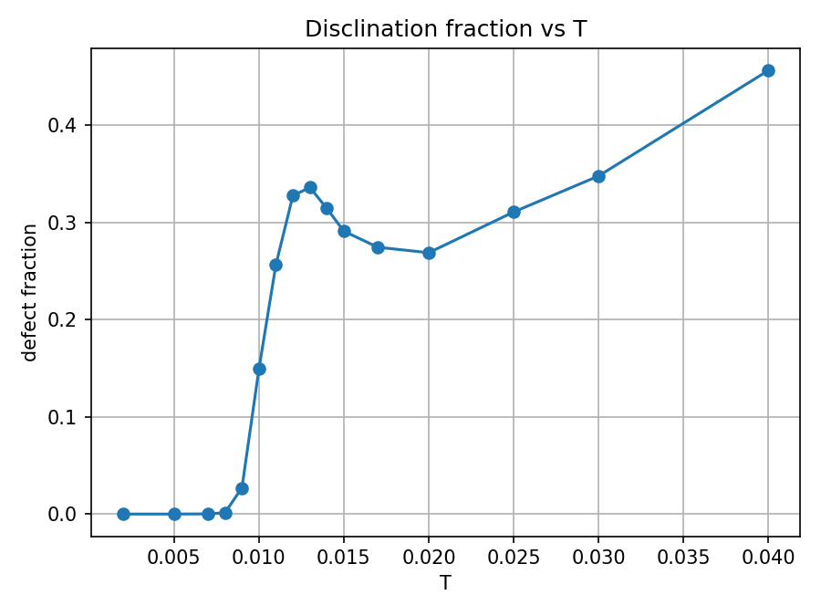
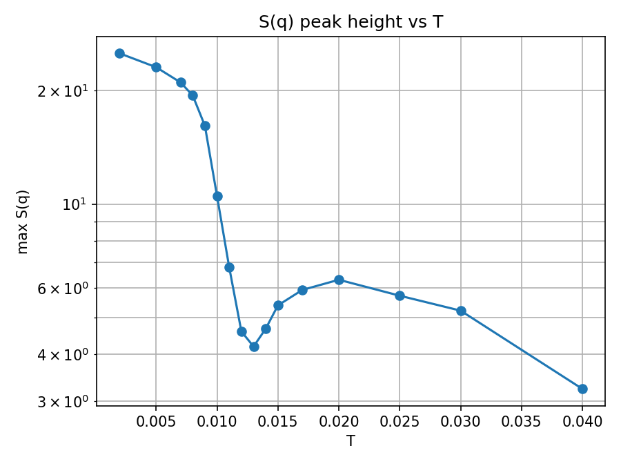
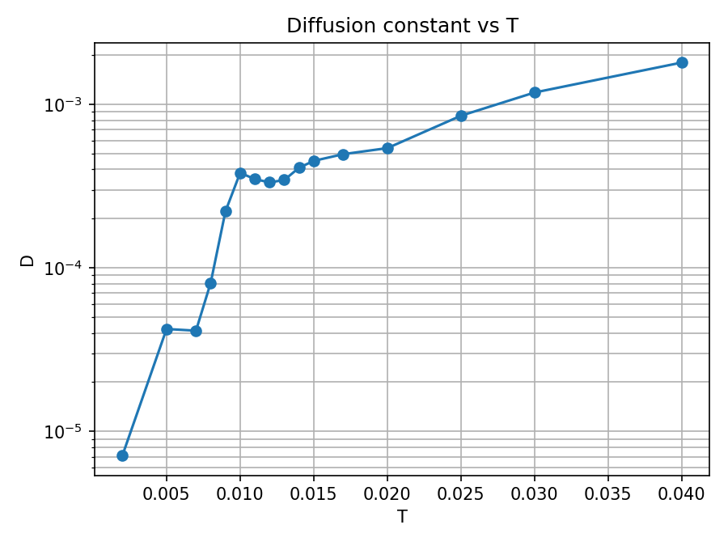
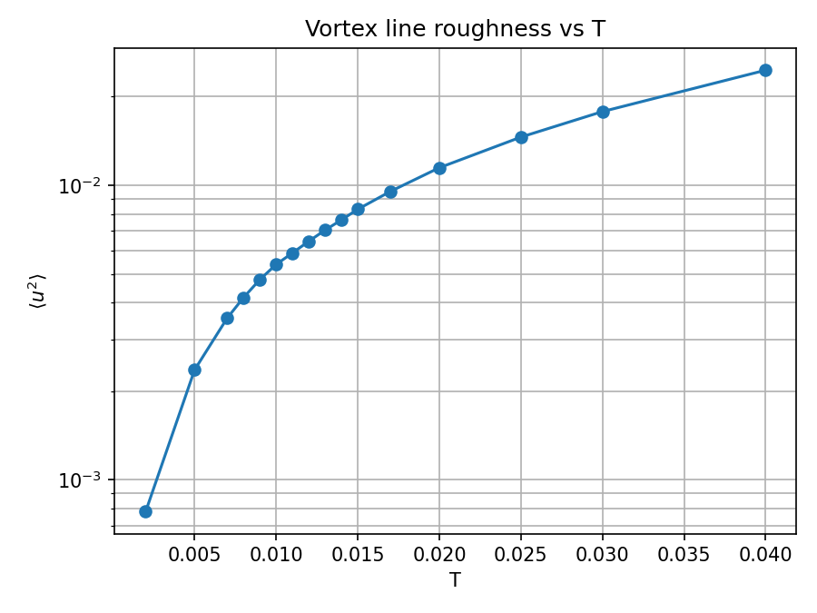
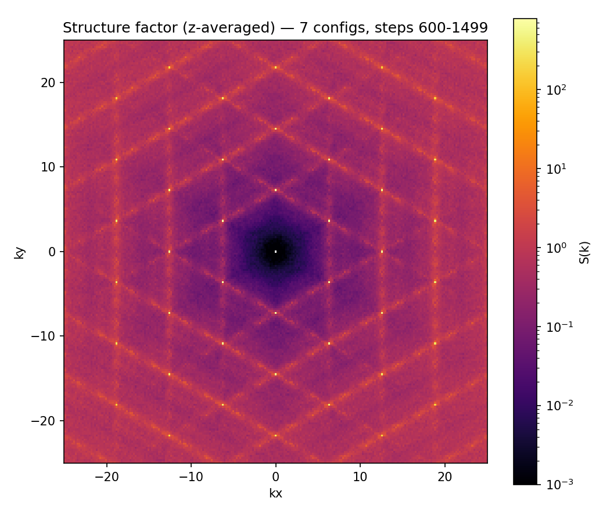
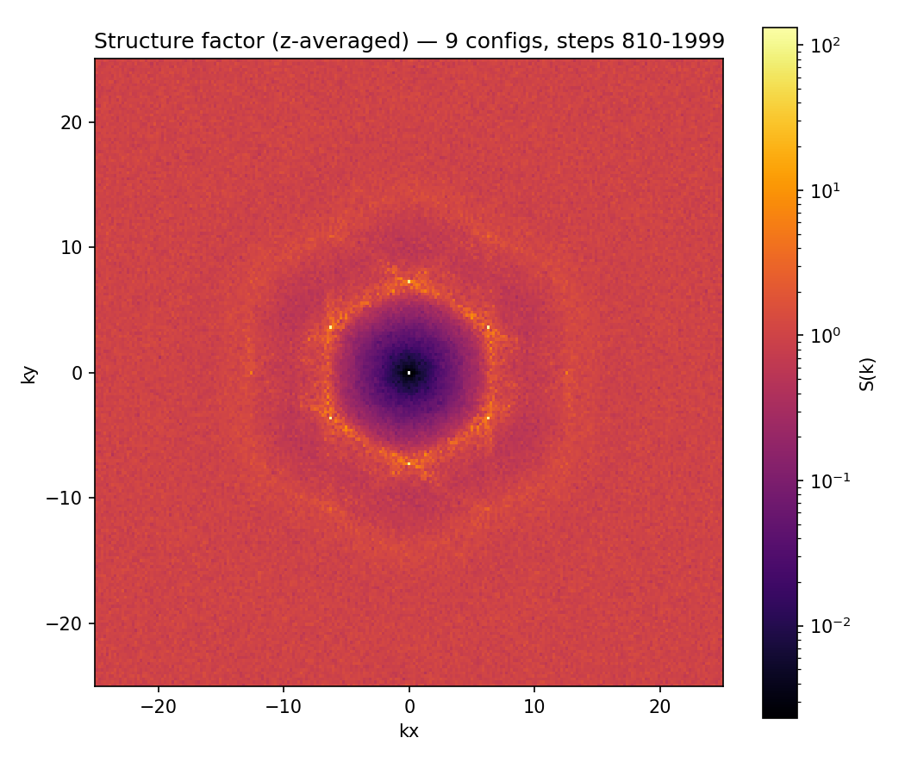
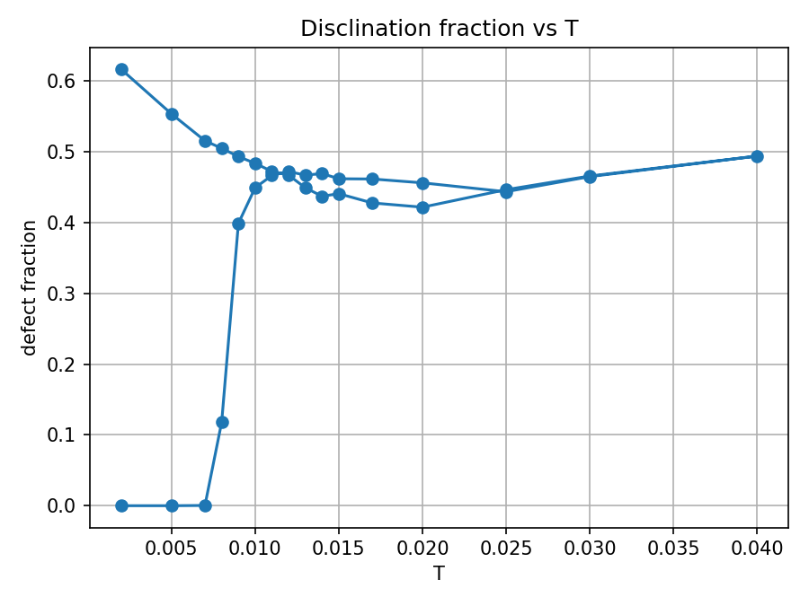
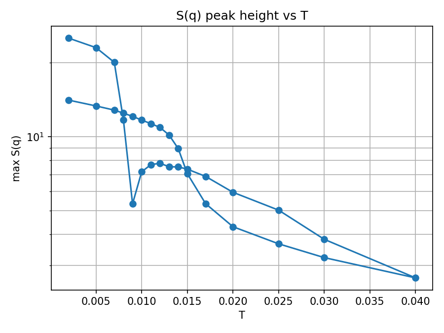

# SLURM sweep on this cluster

Cluster-specific glue for running `tsweep.py` (see the main `README.md`) as
SLURM jobs. Nothing here is portable to another machine as-is -- module
names, paths and the `gpu` partition's node list are all specific to this
cluster.

## This cluster, briefly

- `gpu` partition: `node[210-213]`, heterogeneous -- 4x RTX 3080, 3x RTX
  5070 Ti, 2x RTX 3080 Ti, 1x A10 (10 GPUs total). All but the 5070 Ti are
  Ampere (sm_86); the binary is built for sm_86 with PTX also embedded so
  the driver JITs it on whatever isn't natively sm_86 -- one binary runs
  correctly (verified) on every node in the partition.
- `cpu` partition (default): `node[170-171]`. Used for the CPU-only
  aggregation step.
- CUDA 11.1.0 (module `cuda/11.1.0-zj6lnzj`) is the only CUDA on this
  cluster, paired with `gcc/8.2.0-cytb66h` (the only gcc old enough for
  nvcc 11.1 to accept as a host compiler) and `mpfr/3.1.6-ubdztn6` (that gcc
  module is missing `libmpfr.so.4` unless this is also loaded explicitly).
- Random123 headers aren't packaged here; `slurm/build.sh` clones them
  next to this repo (`<parent of repo>/random123`) if missing. Set
  `RANDOM123_DIR=/path/to/random123/include` to use an existing checkout.
- The analysis scripts need a `python3` with numpy/scipy/matplotlib/pandas.
  `env.sh` puts `~/miniconda3/bin` first on `PATH` if it exists; set
  `CONDA_BASE=/path/to/your/conda` if yours lives elsewhere.

All of that -- plus the actual build workaround -- lives in `slurm/env.sh`,
which every other script here sources. See the comments in that file for
**why** each piece is needed; the short version is that this combination of
old CUDA + very new glibc/Rocky9 headers + a conda base environment that
likes to hijack `nvcc` needed three separate workarounds before `main.cu`
would compile at all.

## Files

| File                  | Purpose                                              |
|------------------------|-------------------------------------------------------|
| `env.sh`               | Module loads + env fixes; `source` this, don't run it |
| `params.sh`            | Physical/run parameters (env-var overridable) for both sweeps |
| `build.sh`             | Clean rebuild of `vortex_sim`/`vortex_sim_on2`        |
| `temperatures.tsv`     | The sweep: one `T steps step_min stride` row per temperature |
| `sweep_array.sbatch`   | One array task = one temperature, on `gpu`, one GPU each |
| `collect.sbatch`       | Runs after the array; rebuilds the combined summary on `cpu` |
| `submit_sweep.sh`      | Submits both of the above with the right dependency   |
| `hysteresis_sweep.sbatch` | Up-then-down sweep over the same file, sequential on one GPU |
| `example_output/`      | Plots + `summary.dat` from a real run of both sweeps  |

## Running a sweep

Run everything from the repo root (the batch scripts find the repo through
`$SLURM_SUBMIT_DIR`).

1. Edit `temperatures.tsv` if you want different temperatures/steps
   (columns: `T steps step_min stride`, same meaning as the matching
   `tsweep.py` flags -- see the main README's "Temperature sweeps" section
   for how to choose them; the shipped file is already tuned to the
   T=0.01-0.015 melting range this project keeps finding).
2. `slurm/submit_sweep.sh` -- builds `vortex_sim` if it isn't there yet,
   submits the array job, then submits the collection job depending on the
   whole array succeeding.
   - `MAX_CONCURRENT=N slurm/submit_sweep.sh` caps how many temperatures run
     at once (default 8; there are 10 GPUs on the partition and it's
     shared, so this leaves headroom rather than grabbing all of them).
   - `slurm/submit_sweep.sh path/to/other.tsv` to sweep a different file
     without touching the default.
3. `squeue -u $USER` to watch it; per-task logs land in
   `slurm/logs/sweep_<jobid>_<taskid>.out`, the final aggregation log in
   `slurm/logs/collect_<jobid>.out`.
4. Results land exactly where `tsweep.py` always puts them:
   `runs/T_<T>/...` per temperature, `runs/summary.dat` and
   `runs/summary_*.png` for the combined melting-scalars-vs-T plots.

Each array task calls `tsweep.py` for just its own temperature (so runs
land in parallel across the GPU partition instead of one after another);
the collect job then reruns `tsweep.py --skip-sim --skip-analysis` across
every temperature, which only re-reads each run's already-computed
`msd_diffusion.dat`/`equil_*.dat` files to stitch them into one
`summary.dat` --
`tsweep.py` only aggregates across the temperatures given to a single
invocation, so this stitching step is what makes the array behave like one
sweep.

Rerunning `slurm/submit_sweep.sh` is **not** incremental: it resubmits the
whole array, and every `sweep_array.sbatch` task reruns the simulation and
analysis for its row, overwriting `runs/T_<T>/`. To add only a few new
temperatures, put just those rows in a separate file and submit that
(`slurm/submit_sweep.sh new_temps.tsv`); note the collect job then only
summarizes the temperatures in that file, so re-run the collect step with
the full file afterwards if you want everything in one `summary.dat`:

```sh
sbatch --export=ALL,TEMPS_FILE=$PWD/slurm/temperatures.tsv slurm/collect.sbatch
```

## Hysteresis sweep

```sh
slurm/build.sh                       # if vortex_sim isn't built yet
sbatch slurm/hysteresis_sweep.sbatch
```

Runs `tsweep.py --hysteresis` over `slurm/temperatures.tsv`: up through
every row, then back down through the same rows minus the peak, each
temperature starting from the previous one's final configuration. Because
each leg depends on the previous one it runs sequentially on a single GPU
(12 h limit), unlike the one-way sweep. Log in
`slurm/logs/hysteresis_<jobid>.out`; results in `runs/hysteresis/`
(`summary.dat`, `summary_*.png`, one numbered folder per leg). Override the
inputs with `sbatch --export=ALL,TEMPS_FILE=...,OUT_DIR=... slurm/hysteresis_sweep.sbatch`.

## Physical and run parameters

Both `sweep_array.sbatch` and `hysteresis_sweep.sbatch` take every
`vortex_sim` parameter from `slurm/params.sh`, which turns environment
variables into `tsweep.py` flags. Defaults are what the `example_output/`
runs used:

| Variable             | Meaning                              | Default   |
|----------------------|--------------------------------------|-----------|
| `NX`, `NY`, `NZ`     | lattice size (in-plane, layers)      | 30, 30, 4 |
| `A0`                 | lattice constant                     | 1.0       |
| `K`                  | inter-layer spring constant          | 0.5       |
| `DT`                 | timestep                             | 0.01      |
| `CUTOFF`             | interaction cutoff radius            | 3.0       |
| `SKIN`               | Verlet skin width                    | 0.5       |
| `SEED`               | RNG seed                             | 1234567   |
| `PRINT_INTERVAL`     | steps between snapshots              | 15        |
| `MSD_WINDOW`         | `msd.py --window` (snapshots)        | 100       |
| `MSD_ORIGIN_SPACING` | `msd.py --origin-spacing` (snapshots)| 10        |

`T`, `steps`, `step_min` and `stride` still come from the temperatures
file; `TEMPS_FILE` and `OUT_DIR` pick the file and the output folder. Give
each parameter set its own `OUT_DIR`, or the runs overwrite each other:

```sh
sbatch --export=ALL,K=1.5,DT=0.005,OUT_DIR=$PWD/runs/hyst_k1.5 slurm/hysteresis_sweep.sbatch
K=1.5 OUT_DIR=$PWD/runs/k1.5 slurm/submit_sweep.sh
```

For many parameters, put `VAR=value` lines in a file and pass
`PARAMS_FILE=/abs/path/to/file` instead; variables also set in the
environment win over the file. Each job log starts with a
`Sim parameters: ...` line showing what it actually used. The wall-time
limit is an `sbatch` option: add `--time=24:00:00` to the `sbatch` call.

## Example output

`example_output/` holds the results of actually running the two jobs above
with the shipped `temperatures.tsv` (30x30x4 lattice, 16 temperatures), so
you can see what to expect before spending GPU time. Everything under
`runs/` is git-ignored; these are copies.

**One-way sweep** (`submit_sweep.sh`, `example_output/sweep/`): the lattice
melts between T~0.009 and T~0.012 -- the disclination fraction jumps from 0
to ~0.33 and the S(q) Bragg peak drops from ~25 to ~4.

| | |
|---|---|
|  |  |
|  |  |

Structure factor below (T=0.005, hexagonal Bragg lattice) and above
(T=0.03, liquid ring) the transition (`example_output/snapshots/`):

| T = 0.005 | T = 0.03 |
|---|---|
|  |  |

**Hysteresis sweep** (`hysteresis_sweep.sbatch`, `example_output/hysteresis/`):
the lower branch is heating, the upper branch is cooling. On cooling, the
system does not recrystallize within the simulated time; the defect fraction
stays around 0.5 all the way down to T=0.002, giving a wide hysteresis loop.

| | |
|---|---|
|  |  |

## Building by hand

```sh
slurm/build.sh
```

or, to see/tweak the exact flags:

```sh
source slurm/env.sh
make clean
make RANDOM123_DIR="$RANDOM123_DIR" NVCCFLAGS="$VORTEX_NVCCFLAGS"
```
